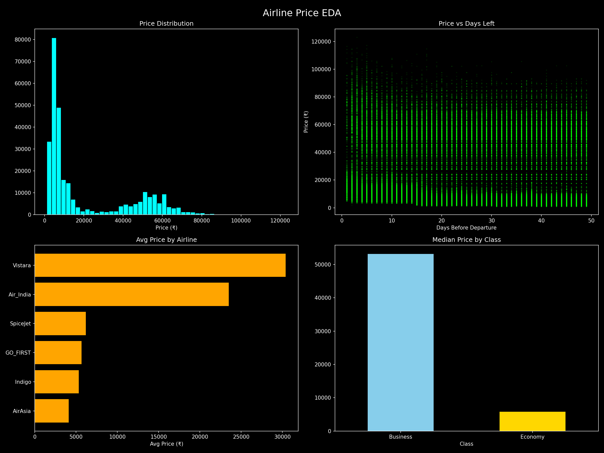

# EPOCH-Datathon — Flight Price Prediction

A data science project for the EPOCH Datathon that explores and models Indian domestic flight prices using EDA, feature engineering, and machine learning.

---

## Table of Contents

- [Overview](#overview)
- [Repository Structure](#repository-structure)
- [Datasets](#datasets)
- [Feature Engineering & Output](#feature-engineering--output)
- [Model](#model)
- [Getting Started](#getting-started)
- [Results](#results)

---

## Overview

This project analyzes Indian domestic flight booking data to:

1. **Understand pricing patterns** via Exploratory Data Analysis (EDA).
2. **Classify flights** as "good price" or not (`is_good_price` binary target).
3. **Predict flight prices** using a regression model.

The raw data covers flights across major Indian cities, including information on airlines, departure/arrival times, number of stops, seat class, and days left before departure.

---

## Repository Structure

```
EPOCH-Datathon/
├── README.md
└── datathon_project/
    └── datathon_project/
        ├── Notebooks/
        │   ├── business.csv        # Raw business-class flight data
        │   ├── economy.csv         # Raw economy-class flight data
        │   └── Clean_Dataset.csv   # Merged & cleaned dataset
        ├── Model/
        │   └── encoders.pkl        # Saved label encoders for categorical features
        └── Output/
            ├── EDA_charts.png      # Exploratory Data Analysis visualizations
            ├── df_classifier.csv   # Encoded dataset for classification
            └── df_regression.csv   # Encoded dataset for regression
```

---

## Datasets

### Raw Data (`business.csv` / `economy.csv`)

| Column | Description |
|---|---|
| `date` | Date of the flight |
| `airline` | Airline carrier name |
| `ch_code` | Airline IATA code |
| `num_code` | Flight number |
| `dep_time` | Departure time |
| `from` | Source city |
| `time_taken` | Flight duration |
| `stop` | Number of stops |
| `arr_time` | Arrival time |
| `to` | Destination city |
| `price` | Ticket price (INR) |

- `economy.csv` — ~540,000 rows of economy-class fares
- `business.csv` — ~262,000 rows of business-class fares

### Cleaned Dataset (`Clean_Dataset.csv`)

~300,000 rows combining both classes after preprocessing:

| Column | Description |
|---|---|
| `airline` | Airline name |
| `flight` | Flight code |
| `source_city` | Departure city |
| `departure_time` | Time-of-day bucket for departure |
| `stops` | Number of stops (`zero`, `one`, `two_or_more`) |
| `arrival_time` | Time-of-day bucket for arrival |
| `destination_city` | Arrival city |
| `class` | Seat class (`Economy` / `Business`) |
| `duration` | Flight duration (hours) |
| `days_left` | Days between booking and departure |
| `price` | Ticket price (INR) |

---

## Feature Engineering & Output

Categorical columns are label-encoded and a `price_ratio` feature (ticket price / mean price for similar routes) is computed.

### `df_classifier.csv`

Same columns as the regression output plus:

| Column | Description |
|---|---|
| `is_good_price` | Binary label — `1` if price is at or below the median for that route |

### `df_regression.csv`

| Column | Description |
|---|---|
| `airline_enc` | Encoded airline |
| `source_city_enc` | Encoded source city |
| `destination_city_enc` | Encoded destination city |
| `route_enc` | Encoded source–destination route |
| `class_enc` | Encoded seat class |
| `stops_enc` | Encoded number of stops |
| `departure_time_enc` | Encoded departure time bucket |
| `arrival_time_enc` | Encoded arrival time bucket |
| `duration` | Flight duration (hours) |
| `duration_bucket_enc` | Encoded duration bucket |
| `days_left` | Days before departure |
| `price_ratio` | Price relative to route average |
| `price` | Ticket price in INR (regression target) |

---

## Model

- **`encoders.pkl`** — A pickled dictionary of `sklearn` `LabelEncoder` objects, one per categorical feature, used to transform and inverse-transform encoded columns.

---

## Getting Started

### Prerequisites

```bash
pip install pandas numpy scikit-learn matplotlib seaborn
```

### Load the clean dataset

```python
import pandas as pd

df = pd.read_csv("datathon_project/datathon_project/Notebooks/Clean_Dataset.csv", index_col=0)
print(df.head())
```

### Load the encoders

```python
import pickle

with open("datathon_project/datathon_project/Model/encoders.pkl", "rb") as f:
    encoders = pickle.load(f)
```

### Load preprocessed data for modelling

```python
# Classification
df_clf = pd.read_csv("datathon_project/datathon_project/Output/df_classifier.csv")

# Regression
df_reg = pd.read_csv("datathon_project/datathon_project/Output/df_regression.csv")
```

---

## Results

EDA visualizations are saved to `datathon_project/datathon_project/Output/EDA_charts.png`.


